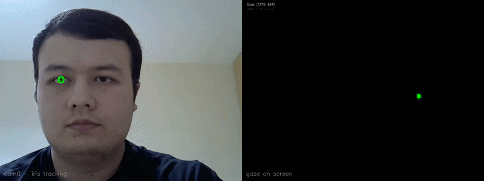

# Stereo Gaze Tracking System

A real-time gaze estimation system built with two webcams and a laptop. The system uses stereo camera calibration and computer vision to track where a user is looking on their laptop screen.

Built as a personal learning experiment to deeply understand camera calibration, epipolar geometry, and 3D reconstruction from first principles.

---

## Demo and setup




---

## Hardware

- 2x Logitech C270 webcams (mounted side by side on laptop screen, ~10cm baseline)
- MacBook M3 13" (2024) — 2560x1664 display

---

## Pipeline

```
Phase 1  →  Single camera calibration
            Intrinsic matrix K + distortion coefficients
            for each camera individually

Phase 2  →  Stereo image capture
            Simultaneous chessboard capture from both cameras

Phase 3  →  Stereo calibration
            R, T, E, F matrices + rectification maps

Phase 4  →  3D eye localization
            MediaPipe iris detection + triangulation
            → real-time 3D eye position in meters

Phase 5  →  Screen calibration
            9-point homography mapping gaze to screen pixels

Phase 6  →  Real-time gaze demo
            Green dot follows your eyes across the screen
```

---

## Results

```
Camera 0 reprojection error:  0.1951 px
Camera 1 reprojection error:  0.1858 px
Stereo reprojection error:    0.4422 px
Camera baseline (measured):   ~10 cm
Camera baseline (computed T): 18.9 cm
```

---

## How to Run

### 1. Install requirements

```bash
pip install -r requirements.txt
```

### 2. Single camera calibration

Open `phase1_single_calibration.py` and change:

```python
cam_id = 0   # change to 1 for second camera
```

Run twice — once for each camera:

```bash
python phase1_single_calibration.py   # cam_id = 0
python phase1_single_calibration.py   # cam_id = 1
```

Saves results to:
```
calibration_results/cam0/K.npy
calibration_results/cam0/dist.npy
calibration_results/cam1/K.npy
calibration_results/cam1/dist.npy
```

### 3. Capture stereo image pairs

```bash
python phase2_capturing_images_for_stereo.py
```

Hold a chessboard in front of both cameras. Press `SPACE` when both cameras detect it. Collect 25+ pairs. Press `Q` when done.

### 4. Stereo calibration

```bash
python phase3_stereo_calibration.py
```

Saves R, T, E, F, rectification maps and projection matrices to `calibration_results/stereo/`.

### 5. Verify 3D eye tracking

```bash
python phase4_eye_tracking.py
```

You should see your iris detected in both cameras with 3D coordinates printed:
```
Left eye 3D: X=-0.144m  Y=0.002m  Z=0.461m
```

Move your head closer and further — Z should change correctly.

### 6. Screen calibration

```bash
python phase5_screen_calibration.py
```

A fullscreen window will show 9 red dots one at a time. Look at each dot and press `SPACE`. Hold completely still for 2 seconds after pressing space. This saves `calibration_results/H_gaze.npy`.

### 7. Run the gaze demo

```bash
python phase6_final_result.py
```

A green dot will follow your eyes across the screen. Press `Q` to quit.

---

## Project Structure

```
Camera_Calibration/
├── phase1_single_calibration.py       ← calibrate each camera (change cam_id)
├── phase2_capturing_images_for_stereo.py  ← capture simultaneous pairs
├── phase3_stereo_calibration.py       ← compute R, T, rectification
├── phase4_eye_tracking.py             ← verify 3D iris localization
├── phase5_screen_calibration.py       ← 9-point homography fitting
├── phase6_final_result.py             ← real-time gaze demo
├── requirements.txt
└── README.md
```

---

## Key Concepts

**Intrinsic matrix K** — encodes focal length and optical center of each camera. Found by photographing a chessboard from many angles.

**Stereo calibration** — finds R (rotation) and T (translation) between the two cameras by showing them the same chessboard simultaneously.

**Rectification** — mathematically warps both images so epipolar lines become horizontal. A point at row 240 in camera 0 must match something at row 240 in camera 1.

**Triangulation** — each camera sees the iris as a 2D pixel. Each pixel defines a ray in 3D space. The intersection of both rays gives the iris position in 3D.

**Homography** — a 3x3 matrix fitted from 9 gaze-screen pairs that directly maps iris offset to screen pixel coordinates, bypassing the need for precise physical geometry.

---

## Requirements

```
opencv-python
mediapipe==0.10.14
numpy
matplotlib
scipy
```

Python 3.11 recommended. MediaPipe 0.10.14 is pinned because newer versions (0.10.15+) removed the `solutions` API used in this project.

---

## Calibration Pattern

A 9x7 inner corner chessboard with 19mm squares printed on A4 paper.
Print at exactly 100% scale — do not fit to page.
Mount flat on cardboard for best results.